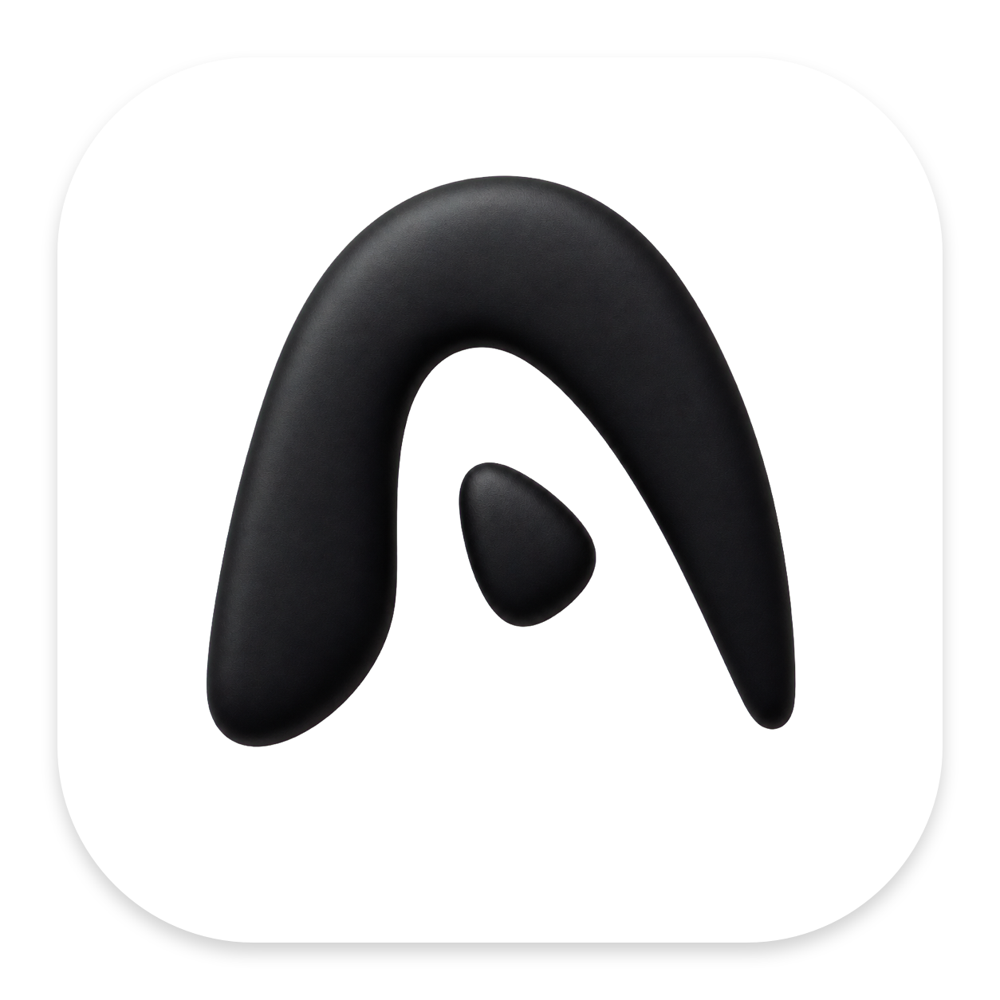
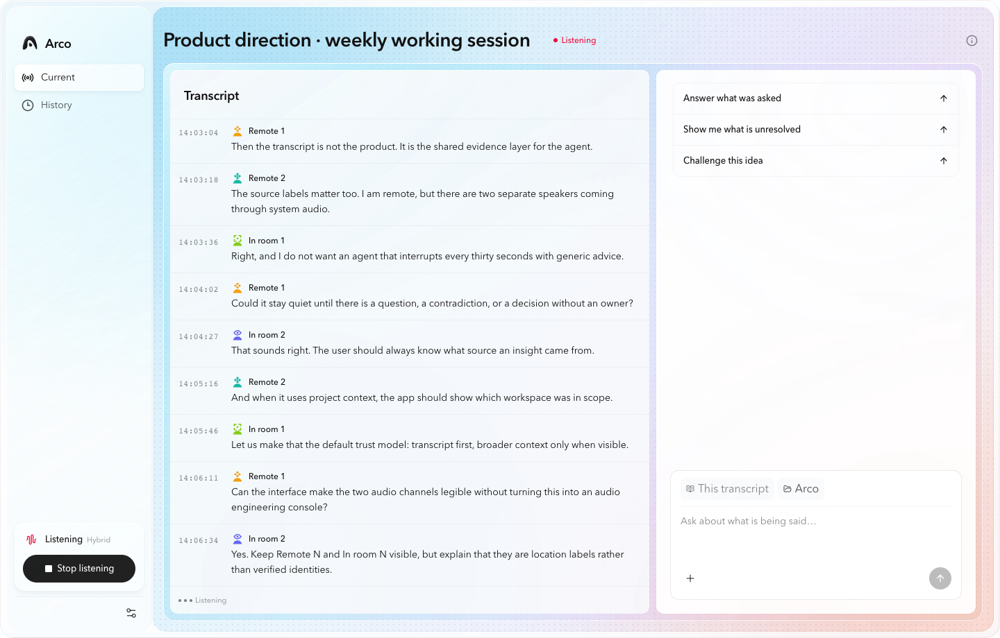
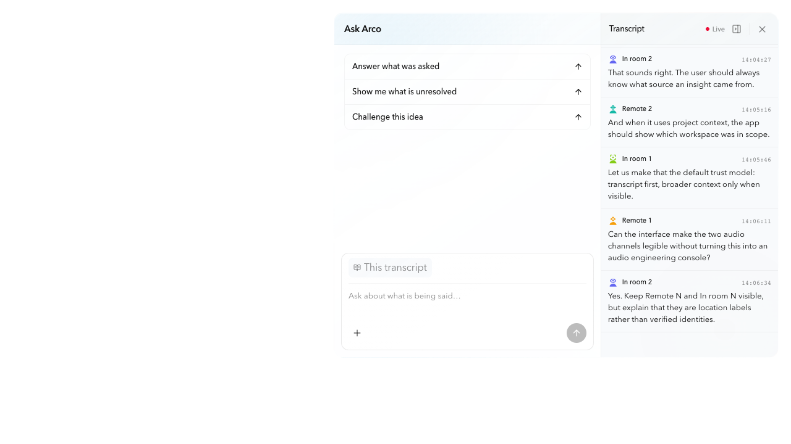
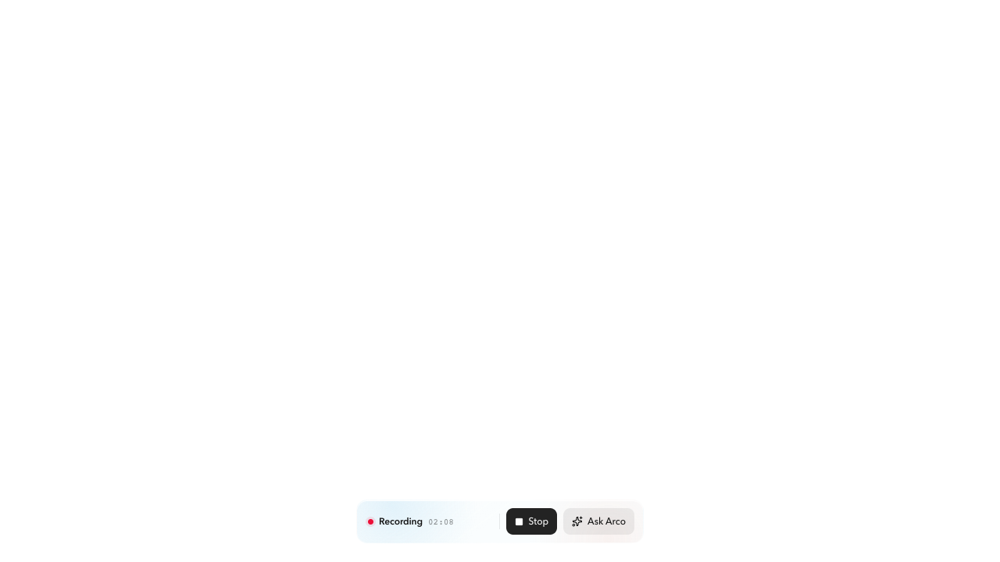
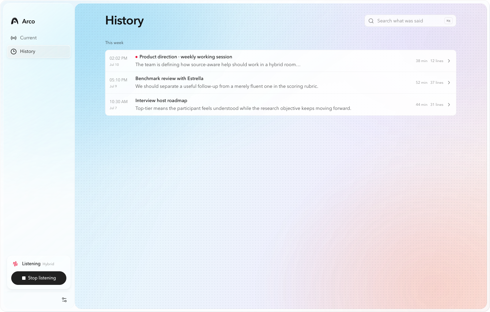

<div align="center">
  

  <h1>Arco</h1>

  <p><strong>Your meeting becomes live context for the agent already on your Mac.</strong></p>

  <p>
    Arco is a local-first, AI-native meeting companion for macOS. It keeps a live,
    speaker-labeled transcript beside Codex or Claude, so you can ask questions,
    challenge an idea, or recover a decision while the conversation is still happening.
  </p>

  <p><strong>macOS 14+</strong> · Local-first · Open source · MIT</p>

  <p><strong>English</strong> · <a href="./README.zh-CN.md">简体中文</a></p>
</div>

## Live context, not another meeting dashboard

Arco keeps the transcript as the evidence layer and the Agent at its right. System audio and the room microphone remain separate, so a hybrid meeting can distinguish `Remote N` from `In room N` without pretending an audio channel is a person.

<p align="center">
  
</p>

## Ask while the meeting is still happening

Use the transcript alone or attach one project workspace through the native macOS folder picker. Arco reuses that workspace for later questions and sends each request through the local Codex or Claude CLI already signed in on your Mac.

<p align="center">
  
</p>

## Stay in the conversation

When Arco is listening, a small always-on-top control stays available across apps and macOS Spaces. Stop recording or open the Agent without returning to the main window.

<p align="center">
  
</p>

## A useful local meeting history

Meetings begin untitled, can be renamed at any time, and can receive an Agent-generated title and summary. History remains searchable and is stored as readable local files rather than hidden inside a hosted account.

<p align="center">
  
</p>

## What Arco does

| Feature | How it works | Why it matters |
| --- | --- | --- |
| Hybrid audio capture | Captures system audio and the room microphone as separate lanes with ScreenCaptureKit and AVAudioEngine. | Online and in-room speakers stay legible in the same meeting. |
| Streaming transcription | Choose Deepgram or an on-device Nemotron / Whisper model. | Use the quality, latency, and privacy boundary that fits the meeting. |
| Multi-speaker separation | Deepgram diarization or optional on-device Streaming Sortformer separates anonymous speakers within each lane. | One microphone can contain several people; Arco never labels the whole mic as “You.” |
| Native local Agent | Sends questions through Codex CLI or Claude Code already installed and authenticated on the Mac. | Your meeting assistant can use the same project understanding and account you already trust. |
| Explicit context | Every question includes the meeting transcript; a selected workspace can be attached visibly from the composer. | Broader context is intentional, inspectable, and never inferred from an unrelated folder. |
| Native session continuity | Each meeting, provider, and context boundary is bound to its exact Codex / Claude session. | Follow-up questions preserve continuity without using `--last` or selecting an unrelated conversation. |
| Automatic meeting output | Generates a title after enough evidence and a summary when the meeting ends; both prompts are configurable. | Meetings become useful records without requiring a title or note-taking ritual up front. |
| Local history | Stores Markdown transcripts and local sidecars under Arco's Application Support directory or a folder you choose. | Your meeting record remains portable, searchable, and under your control. |

## Why Arco

Most meeting tools record first and ask you to review later. Arco is designed for the moment when you need help now: *What did they actually ask for? What is still unresolved? Which assumption should we challenge?*

The Agent is not a separate hosted chatbot. It is the Codex or Claude CLI already on your Mac, grounded in the live transcript and—only when you attach it—the selected project workspace.

## Privacy

Arco is local-first and open source.

By default, transcripts and meeting state live at:

```text
~/Library/Application Support/Arco/
```

- Choose a different transcript folder at any time; previously used locations remain readable in History.
- Arco streams audio for transcription but does not save raw PCM recordings.
- With on-device transcription and diarization, speech processing stays on the Mac.
- With Deepgram, audio is sent to Deepgram for transcription.
- Agent questions are sent through the selected local CLI. The composer always shows whether only the transcript or the transcript plus a workspace is in scope.
- Codex transcript and workspace runs add a read-only macOS sandbox around the CLI process.

## Build the desktop app

### Requirements

- macOS 14 or newer
- Apple Silicon recommended for on-device models
- Node.js 22+, pnpm, Rust, and the Swift toolchain
- Codex CLI or Claude Code for Agent features
- `uv` (or Python with `websockets`) for Deepgram transcription

### Run from source

```bash
git clone https://github.com/xilanhua12138/Arco.git
cd Arco
pnpm install
pnpm build:native
pnpm desktop
```

For a UI-only browser preview:

```bash
pnpm dev
```

To create a locally ad-hoc-signed macOS archive:

```bash
pnpm desktop:package
```

The archive is written to `artifacts/Arco-local-macos-<arch>.zip`. Public distribution still requires Developer ID signing, notarization, and a release channel.

Deepgram reads `DEEPGRAM_API_KEY` from the launch environment. See [`.env.example`](./.env.example). On-device models are downloaded on demand from **Settings → Audio & speakers → Recognition** and live under `~/Library/Application Support/Arco/models/`.

## The original Agent Skill is still here

Arco began as a small Agent Skill and has grown into a complete desktop application. The original [`SKILL.md`](./SKILL.md), command-line scripts, and standalone listener remain available in this repository for people who prefer the skill workflow.

```bash
git clone https://github.com/xilanhua12138/Arco.git ~/.claude/skills/arco
cd ~/.claude/skills/arco
bash bin/init.sh
```

See [`SKILL.md`](./SKILL.md) for its commands and requirements. The desktop app also reads existing `~/.claude/meeting-transcripts/` history without overwriting it.

## Verify the source

```bash
pnpm lint
pnpm test
pnpm build
pnpm test:e2e
cargo test --manifest-path src-tauri/Cargo.toml
pnpm design:detect
pnpm desktop:package
```

## Architecture

- **Tauri + Rust** owns windows, storage, capture lifecycle, Agent processes, and native session bindings.
- **React + TypeScript** renders the main workspace, History, Settings, onboarding, and global Agent surfaces.
- **Swift** captures macOS audio and runs the on-device transcription pipeline.
- **Markdown + atomic JSON sidecars** keep transcript evidence separate from Agent answers and saved notes.

Read [PRODUCT.md](./PRODUCT.md), [DESIGN.md](./DESIGN.md), [docs/ARCHITECTURE.md](./docs/ARCHITECTURE.md), and [docs/TRANSCRIPTION.md](./docs/TRANSCRIPTION.md) for the detailed contracts.

## Contributing

Issues and pull requests are welcome. For a larger product or architecture change, open an issue first so the intended behavior and privacy boundary are clear.

## License

Arco is licensed under the [MIT License](./LICENSE).
