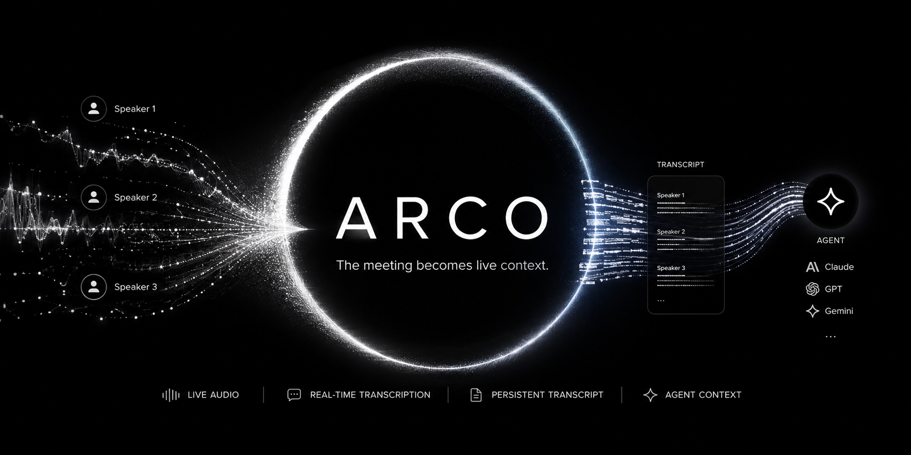

# Arco



An [agent skill](https://agentskills.io) that listens to a meeting and keeps a
live, speaker-labeled transcript on disk — so you can ask your assistant to
summarize, pull action items, or answer questions about what was just said,
grounded in the actual words. It works with any agent that runs skills with
local shell access (Claude Code, or anything that follows the Agent Skills
standard).

It captures **system audio** (whoever you're on a call with) and your
**microphone**, mixes them, and runs [Deepgram](https://deepgram.com)'s
real-time speech-to-text with diarization. Each line comes out tagged
`Speaker 1 / Speaker 2 / Speaker 3…` and lands in a Markdown file that Claude
Code reads directly.

It's macOS-only — the capture side is built on ScreenCaptureKit, so there's no
BlackHole or virtual audio device to install.

## Why

I kept wanting to ask Claude "wait, what did they just say they wanted?" in the
middle of a call, and copy-pasting from a meeting-notes app was clumsy. Arco
just keeps the transcript in a file Claude already has access to. No app to
switch to, no bot to invite into the call.

## How it works

```
recorder (Swift)                                         listen.py
ScreenCaptureKit system audio + AVAudioEngine mic
mixed/resampled → 16k mono PCM ──stdout│stdin──────────► Deepgram realtime ASR
                                                           (diarize=true)
                                                                │
                                      appended live ◄───────────┘
                           ~/.claude/meeting-transcripts/current.md
```

- `recorder.swift` taps system output through ScreenCaptureKit, captures the
  mic through AVAudioEngine, mixes/resamples both to 16 kHz mono PCM, and writes
  raw bytes to stdout.
- `listen.py` pipes that into Deepgram over a WebSocket and appends each
  finalized utterance to the transcript.
- your assistant reads `current.md` whenever you ask it something.

## Install

Clone into your skills directory (`~/.claude/skills/` for Claude Code):

```bash
git clone https://github.com/xilanhua12138/Arco.git ~/.claude/skills/arco
```

You need:

- macOS (recent enough for ScreenCaptureKit microphone capture)
- the Swift toolchain (`swiftc` — ships with Xcode / Command Line Tools)
- [`uv`](https://docs.astral.sh/uv/) (it pulls in `websockets` on the fly, nothing to `pip install`)
- a Deepgram API key — the free tier comes with enough credit to run this for a long time

Initialize the checkout:

```bash
cd ~/.claude/skills/arco
bash bin/init.sh
# if init.sh created .env or reports a missing key, edit .env and paste your DEEPGRAM_API_KEY
bash bin/init.sh
```

`init.sh` checks the local toolchain, creates `.env` when needed, refreshes
`ARCO_MIC_DEVICE_ID` / `ARCO_MIC_DEVICE_NAME` to the current macOS default
microphone, preloads the Python `websockets` dependency, and compiles/signs the
recorder. The first `start.sh` after initialization asks macOS for **Screen
Recording** and **Microphone** permission — grant both. The command-line
`recorder` binary sometimes has to be ticked by hand under *System Settings →
Privacy & Security → Screen Recording*; do that once and start it again.

## Use

```bash
bash bin/start.sh both     # system audio + mic (default)
bash bin/start.sh system   # only the other side of the call
bash bin/start.sh mic      # in-person meeting, mic only

bash bin/mic-id.sh --write-env  # refresh the current default mic ID in .env
bash bin/status.sh         # is it running + the last few lines
bash bin/stop.sh           # stop
```

While it runs, the transcript lives at
`~/.claude/meeting-transcripts/current.md` and updates line by line. You can
just ask your assistant "summarize the meeting so far" or "what did they ask me
to follow up on?" and it reads the file.

When you tell Claude the meeting is over (or ask for a final summary), the skill
stops the listener automatically — it won't keep recording in the background.
Each session is kept at `meeting-<timestamp>.md`; `current.md` always points at
the latest one.

## Config

`.env` (see `.env.example`):

| Variable | Default | Notes |
|----------|---------|-------|
| `DEEPGRAM_API_KEY` | — | required |
| `DEEPGRAM_MODEL` | `nova-3` | Deepgram model |
| `DEEPGRAM_LANG` | `zh-Hans` | Mandarin Simplified; use `en` for English meetings |

A note on the model: `nova-3` with `zh-Hans` gave by far the cleanest Mandarin
in my testing. `nova-2`/`zh` garbled characters, and `nova-3`/`multi`
mis-decoded Chinese entirely. For English meetings set `DEEPGRAM_LANG=en`.

## Things worth knowing

- **Don't mute your system output.** Arco taps the output stream, so if the
  call is muted on your end there's nothing to capture.
- **Diarization needs a moment to settle.** The very first word or two of a
  session can get mislabeled while Deepgram's diarizer warms up.
- **Build artifact isn't committed.** `recorder` is compiled locally
  (`bin/build.sh`), so it's gitignored. Re-run the build after editing
  `recorder.swift`.
- **Deepgram, not Doubao.** Doubao's speaker diarization only exists in its
  offline file-recognition API, not the streaming endpoint, so it can't label
  speakers live. Deepgram does it in a single WebSocket.

## License

MIT — see [LICENSE](./LICENSE).
