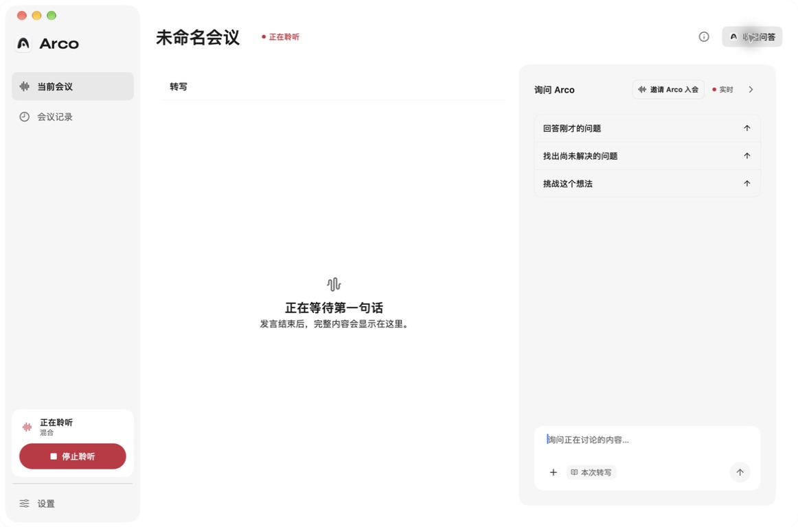
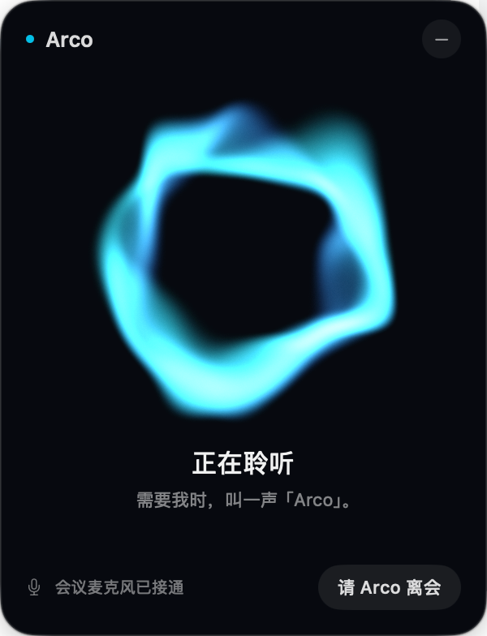

<div align="center">
  

  <h1>Arco</h1>

  <p><strong>Your meeting becomes live context for the agent already on your Mac.</strong></p>

  <p>
    Arco is a local-first, AI-native meeting companion for macOS. It keeps a live,
    speaker-labeled transcript beside Codex or Claude, so you can ask questions,
    challenge an idea, or recover a decision while the conversation is still happening.
  </p>

  <p><strong>macOS 14+</strong> · Local-first · Open source · MIT</p>

  <p><strong>English</strong> · <a href="./README.zh-CN.md">简体中文</a></p>

  <p>
    <a href="https://github.com/xilanhua12138/Arco/releases"><strong>Download for macOS</strong></a>
    · <a href="#development">Build from source</a>
  </p>
</div>

## Why Arco

Most meeting tools record first and ask you to review later. Arco is designed for the moment when you need help now: *What did they actually ask for? What is still unresolved? Which assumption should we challenge?*

The Agent is not a separate hosted chatbot. It is the Codex or Claude CLI already on your Mac, grounded in the live transcript and—only when you attach it—the selected project workspace.

When that local CLI is signed in with your Codex or Claude subscription, Arco uses the subscription allowance you already have. Agent features require neither a separate Arco AI subscription nor an OpenAI or Anthropic API key.

## Download the macOS app

Download the latest Apple Silicon `.dmg` from [GitHub Releases](https://github.com/xilanhua12138/Arco/releases), open it, and drag `Arco.app` to Applications. Arco requires macOS 14 or newer.

The current preview build uses Arco's stable local development signature but is not yet Apple-notarized. On first launch, Control-click `Arco.app`, choose **Open**, then confirm once. Provider credentials are stored in a private local file; normal app use does not request Keychain access. The release includes the recorder, cloud transcription helpers, and local-transcriber worker; Whisper, Nemotron, and on-device speaker-separation models are downloaded only when you choose them in **Settings → Listening & recording → Recognition**.

## Invite Arco to your meeting

> **Development preview · September 2026.** These are real screenshots of a local development build. The participant window and automatic meeting-microphone routing shown here are not yet included in the public source or the v0.3.24 release.

Invite Arco to listen alongside you in an online, in-person, or hybrid meeting. System audio carries remote participants; your physical microphone captures the room. Arco stays quiet until addressed by name, then responds by voice. Questions about the meeting use the transcript-aware Codex or Claude Agent for context.

<p align="center">
  
  <br>
  <sub>Start transcription on its own, then invite Arco when you want voice participation.</sub>
</p>

The invitation opens a separate, always-on-top participant card. Its Aura visualization uses the official [LiveKit Agents UI shader](https://github.com/livekit/components-js/blob/main/packages/shadcn/components/agents-ui/agent-audio-visualizer-aura.tsx), adapted to native Metal, and reflects listening, thinking, and speech playback.

<p align="center">
  
</p>

| Action | What happens |
| --- | --- |
| Start listening | Transcription begins. Arco does not join automatically. |
| Invite Arco | Opens the participant card and connects voice. If needed, starts a new current meeting. |
| Select “Arco is in the meeting” | Brings back the same card without restarting or ending the session. |
| Hide the card | Arco stays in the meeting. Reopen it from the meeting page. |
| Ask Arco to leave | Closes the card, ends voice participation, and restores the microphone. Transcription continues. |
| Stop listening or quit Arco | Ends recording and voice participation, and restores the microphone. |

Drag the card by its title area; its position is remembered. Opening a historical meeting does not invite Arco, and inviting from history does not append new audio to the old record.

**Let other participants hear Arco.** The preview mixes your physical microphone with Arco’s replies through BlackHole 2ch. Configure the audio component during onboarding, or skip and finish later in Settings. In Feishu, select **Same as system** once from the microphone menu before or during a call. Arco then switches the system input when it joins and restores it when it leaves. Without that setup, replies play locally. Installation is not triggered in the middle of an invitation.

Arco participates through local audio capture and routing; it does not appear as a separate bot in Feishu’s participant list. Remote system audio is excluded from the microphone send mix to avoid sending participants their own audio back.

## Live context, not another meeting dashboard

Arco keeps the transcript as the evidence layer and the Agent at its right. System audio and the room microphone remain separate, so a hybrid meeting can distinguish `Remote N` from `In room N` without pretending an audio channel is a person.

<p align="center">
  
</p>

## Ask without leaving the conversation

Use the transcript alone or attach one project workspace through the native macOS folder picker. Arco reuses that workspace for later questions and sends each request through the local Codex or Claude CLI already signed in on your Mac. While Arco is listening, the always-on-top recording control and Agent stay available across apps and macOS Spaces, so you can ask, stop, or return to the evidence without leaving the conversation.

<p align="center">
  
</p>

## A useful local meeting history

Meetings begin untitled, can be renamed at any time, and can receive an Agent-generated title and summary. Text questions and answers are retained with their meeting automatically. Meeting history remains searchable and stored locally. Existing note files remain accessible from Data & privacy; there is no separate Notes workspace.

<p align="center">
  
</p>

## What Arco does

| Feature | How it works | Why it matters |
| --- | --- | --- |
| Hybrid audio capture | Captures system audio and the room microphone as separate lanes with ScreenCaptureKit and AVAudioEngine. | Online and in-room speakers stay legible in the same meeting. |
| Streaming transcription | Choose Deepgram, Doubao, ElevenLabs, or an on-device Nemotron / Whisper model. | Use the quality, latency, and privacy boundary that fits the meeting. |
| Multi-speaker separation | Choose Deepgram, Doubao, or a local Sortformer, Pyannote + WeSpeaker, or LS-EEND model independently from ASR. Mixed cloud/on-device pipelines remain streaming. | One microphone can contain several people; Arco never labels the whole mic as “You.” |
| Native local Agent | Sends questions through Codex CLI or Claude Code already installed and authenticated on the Mac. | Your meeting assistant can use the same project understanding and account you already trust. |
| GPT Live voice (Beta) | Enable the voice Beta in Settings, connect ChatGPT with OAuth, and explicitly start a live voice session from the meeting. The participant-card workflow above is the next development preview. | Ask hands-free questions and hear concise answers; questions about meeting progress are delegated to the current transcript-aware Agent. |
| Explicit context | Every question includes the meeting transcript; a selected workspace can be attached visibly from the composer. | Broader context is intentional, inspectable, and never inferred from an unrelated folder. |
| Native session continuity | Each meeting, provider, and context boundary is bound to its exact Codex / Claude session. | Follow-up questions preserve continuity without using `--last` or selecting an unrelated conversation. |
| Automatic meeting output | Generates a title after enough evidence and a summary when the meeting ends; both prompts are configurable. | Meetings become useful records without requiring a title or note-taking ritual up front. |
| Meeting discussions | Revisit text questions and answers with their source meeting, or copy a reply into another tool. | Continue exploring an idea without a separate save step. |
| Local history | Stores Markdown transcripts and local sidecars under Arco's Application Support directory or a folder you choose. | Your meeting record remains portable, searchable, and under your control. |

## Privacy

Arco is local-first and open source.

By default, transcripts and meeting state live at:

```text
~/Library/Application Support/Arco/
```

- Choose a different transcript folder at any time; previously used locations remain readable in History.
- Existing note files are preserved; open their original folder from Data & privacy.
- Meeting audio is saved locally as compressed AAC/M4A by default, under `~/Music/Arco/Recordings`, with a 10 GB limit. Disable **Save meeting recordings** in **Settings → Data & privacy** to keep transcription without audio archives. The limit removes the oldest Arco audio segments, not transcripts or summaries. See [audio storage](docs/features/recording-audio-storage.md).
- With on-device ASR and diarization, speech processing stays on the Mac.
- Selecting Deepgram for either ASR or speaker separation sends meeting audio to Deepgram.
- Selecting Doubao for either ASR or speaker separation sends meeting audio to Doubao Speech. When selected for both roles, Arco uses Doubao's fused streaming recognition and automatic speaker separation.
- Selecting ElevenLabs ASR sends audio to ElevenLabs. Its realtime API does not supply speaker identities, but Arco can label its finalized segments from the separately selected Deepgram or local streaming diarizer.
- Speaker separation is incremental during the meeting. Arco does not run a later batch pass or rewrite the transcript after capture stops.
- Deepgram, Doubao Speech, and ElevenLabs credentials are verified by the Rust backend and stored in separate entries in `~/.arco/credentials.json` (directory permissions `700`, file permissions `600`); they are never written to a transcript or log.
- Agent questions are sent through the selected local CLI. The composer always shows whether only the transcript or the transcript plus a workspace is in scope.
- Codex transcript and workspace runs add a read-only macOS sandbox around the CLI process.
- GPT Live is an opt-in Beta and is off by default. Arco sends the active meeting audio to OpenAI only after you explicitly start a voice session. Ending that session or stopping the meeting disconnects it. In the development preview, hiding the participant card keeps the voice session active; **Leave** ends it.
- ChatGPT OAuth credentials for GPT Live are stored in `~/.arco/credentials.json` and are managed separately from the Codex CLI login. This Beta currently depends on an undocumented ChatGPT backend interface and may stop working for some accounts or after upstream changes.

## Development

### Requirements for building from source

- macOS 14 or newer
- Apple Silicon recommended for on-device models
- Rust and the Xcode/Swift 6 toolchain
- Codex CLI or Claude Code for Agent features

### Run from source

```bash
git clone https://github.com/xilanhua12138/Arco.git
cd Arco
./native/build-recorder.sh
./native/build-deepgram-transcriber.sh
./native/build-elevenlabs-transcriber.sh
./native/build-doubao-transcriber.sh
./native/build-local-transcriber.sh
ARCO_BUILD_PROFILE=debug ARCO_SKIP_CODESIGN=1 ./native/build-native-app.sh
open build/Arco.app
```

To create the same locally signed macOS archive used for preview releases:

```bash
./native/package-local-app.sh
```

The installer image and checksum are written to `artifacts/Arco-macos-<arch>.dmg` and `artifacts/Arco-macos-<arch>.dmg.sha256`. A future generally available build will add Developer ID signing and Apple notarization.

Open **Settings → Listening & recording → Recognition** to choose ASR and streaming speaker separation independently. Any selected cloud provider requires its own verified key; Arco verifies it through the provider's official endpoint and stores it in `~/.arco/credentials.json`. On-device models live under `~/Library/Application Support/Arco/models/`.

## The original Agent Skill is still here

Arco began as a small Agent Skill and has grown into a complete desktop application. The original [`SKILL.md`](./SKILL.md), command-line scripts, and standalone listener remain available in this repository for people who prefer the skill workflow.

```bash
git clone --depth 1 --filter=blob:none --no-checkout \
  https://github.com/xilanhua12138/Arco.git ~/.claude/skills/arco
cd ~/.claude/skills/arco
git sparse-checkout init --no-cone
git sparse-checkout set \
  /SKILL.md /.env.example /listen.py /recorder.swift /bin/
git checkout
bash bin/init.sh
```

This sparse checkout downloads only the files used by the Agent Skill, not the desktop application source.

See [`SKILL.md`](./SKILL.md) for its commands and requirements. The desktop app also reads existing `~/.claude/meeting-transcripts/` history without overwriting it.

## Verify the source

```bash
cargo test --manifest-path rust/arco-core/Cargo.toml
cargo build --manifest-path rust/arco-core/Cargo.toml --lib
swift build --package-path macos/ArcoNativeUI
swift run --package-path macos/ArcoNativeUI ArcoNativeUIContractTests
swift run --package-path macos/ArcoNativeUI ArcoPreferencesContractTests
swift run --package-path macos/ArcoNativeUI ArcoLocalizationContractTests
ARCO_BUILD_PROFILE=debug ARCO_SKIP_CODESIGN=1 ./native/build-native-app.sh
./native/package-local-app.sh
```

## Architecture

- **SwiftUI** renders the main workspace, History, Settings, onboarding, recording HUD, global Agent window, and every Liquid Glass surface/control. AppKit is limited to native window/panel lifecycle, global shortcuts, and system pickers.
- **Rust static library + C ABI** runs in the Arco process and owns storage, capture orchestration, credentials, provider routing, Agent lifecycle, and native session bindings.
- **Managed worker processes** isolate the recorder, cloud transcription helpers, and the FluidAudio/SwiftWhisper/Nemotron local pipeline so a model crash or memory spike does not take down the UI process. Codex and Claude remain external CLI processes.
- **Markdown + atomic JSON sidecars** keep transcript evidence separate from Agent answers. Text discussions remain attached to the source meeting.

Read [PRODUCT.md](./PRODUCT.md), [DESIGN.md](./DESIGN.md), [docs/ARCHITECTURE.md](./docs/ARCHITECTURE.md), and [docs/TRANSCRIPTION.md](./docs/TRANSCRIPTION.md) for the detailed contracts.

## Acknowledgements

Special thanks to [FluidVoice](https://github.com/altic-dev/FluidVoice) for showing how fast, private, on-device voice software can feel native on macOS and for informing Arco's local model and provider matrix. FluidVoice is an inspiration boundary only: Arco does not copy or redistribute its GPL-3.0 source, and no FluidVoice library is linked into the main app. Arco's direct FluidAudio and SwiftWhisper dependencies live only in the isolated local-transcriber worker; the complete dependency and license boundaries are documented in [docs/TRANSCRIPTION.md](./docs/TRANSCRIPTION.md).

## Contributing

Issues and pull requests are welcome. For a larger product or architecture change, open an issue first so the intended behavior and privacy boundary are clear.

## License

Arco is licensed under the [MIT License](./LICENSE).

Existing Keychain credentials can be re-entered in Settings or imported once using the [credential migration instructions](docs/features/credential-file-storage.md). The new app does not fall back to Keychain.
