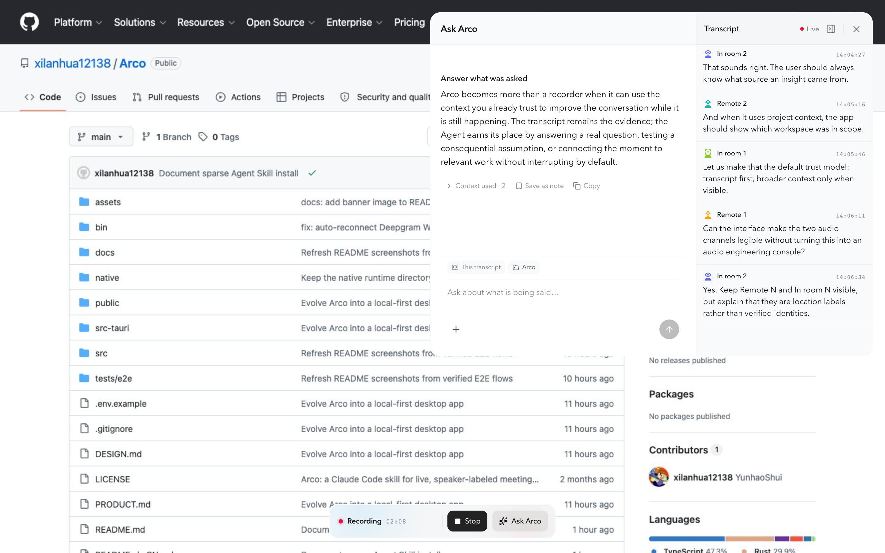

<div align="center">
  

  <h1>Arco</h1>

  <p><strong>让会议成为你 Mac 上本地 Agent 的实时上下文。</strong></p>

  <p>
    Arco 是一款面向 macOS 的本地优先、AI Native 会议助手。它把带说话人标签的实时转写
    放在 Codex 或 Claude 旁边，让你在会议仍在进行时提问、挑战观点或找回关键决定。
  </p>

  <p><strong>macOS 14+</strong> · 本地优先 · 开源 · MIT</p>

  <p><a href="./README.md">English</a> · <strong>简体中文</strong></p>

  <p>
    <a href="https://github.com/xilanhua12138/Arco/releases"><strong>下载 macOS 应用</strong></a>
    · <a href="#开发">从源码构建</a>
  </p>
</div>

## 为什么做 Arco

大多数会议工具先录制，再让你会后回顾。Arco 面向的是会议中的即时需求：*对方刚才真正要的是什么？还有什么没解决？哪个假设值得挑战？*

它不是另一个托管聊天机器人，而是你 Mac 上原本就在使用的 Codex 或 Claude。它默认以实时转写为依据，只在你主动附加时读取所选项目工作区。

只要本地 CLI 已登录你的 Codex 或 Claude 订阅，Arco 就直接使用你已有的订阅额度。Agent 功能不需要额外订阅 Arco AI，也不需要配置 OpenAI 或 Anthropic API Key。

## 下载 macOS 应用

从 [GitHub Releases](https://github.com/xilanhua12138/Arco/releases) 下载最新 Apple Silicon `.dmg`，打开后把 `Arco.app` 拖到“应用程序”文件夹。Arco 需要 macOS 14 或更高版本。

当前预览版使用 ad-hoc 签名，尚未经过 Apple 公证。第一次启动时，请按住 Control 点击 `Arco.app`，选择**打开**并确认一次。安装包已经包含原生音频与 Rust Deepgram 运行时；Whisper、Nemotron 和说话人分离模型只会在你进入**设置 → 音频与说话人 → 识别**并主动选择后下载。

## 实时上下文，而不是另一个会议仪表盘

Arco 把转写作为证据层，把 Agent 固定在右侧。系统音频与房间麦克风始终分离，因此混合会议可以区分 `远程 N` 和 `现场 N`，也不会把一整条音频通道误认为某一个人。

<p align="center">
  
</p>

## 不离开当前对话，直接提问

你可以只参考本次转写，也可以通过 macOS 原生文件夹选择器附加一个项目工作区。Arco 会为后续问题复用该工作区，并通过这台 Mac 上已登录的 Codex CLI 或 Claude Code 发起请求。监听期间，录音控制与 Agent 会跨应用和 macOS Space 保持在最上层，让你无需离开当前对话就能提问、停止录制或回到转写证据。

<p align="center">
  
</p>

## 真正有用的本地会议历史

会议可以先以未命名状态开始，随时手动改名，也可以由 Agent 在内容足够时生成标题，并在结束后自动生成总结。每场会议还能拥有多条手写或由 Agent 回答保存而来的 Markdown 笔记。历史与笔记都支持搜索，并保存在可读的本地文件中。

<p align="center">
  
</p>

## Arco 能做什么

| 功能 | 工作方式 | 价值 |
| --- | --- | --- |
| 混合会议采集 | 使用 ScreenCaptureKit 与 AVAudioEngine，分别采集系统音频和房间麦克风。 | 同一场会议里的线上和现场发言都清晰可辨。 |
| 流式转写 | 可选择 Deepgram，或本地 Nemotron / Whisper 模型。 | 自由权衡识别质量、延迟与隐私。 |
| 多说话人分离 | 独立选择 Deepgram，或本地 Streaming Sortformer、Pyannote + WeSpeaker、LS-EEND，在每条音频通道内增量分离匿名说话人。 | 一个麦克风可能听到多人，Arco 不会把整条麦克风通道标记为“你”。 |
| 本地原生 Agent | 调用 Mac 上已经安装并登录的 Codex CLI 或 Claude Code。 | 会议助手可以使用你已经信任的账号和项目理解。 |
| 显式上下文 | 每次问题都包含会议转写；用户可以在输入框里明确附加一个工作区。 | 更广的上下文是可见且主动选择的，不会从无关目录里猜测。 |
| 原生会话连续性 | 每场会议、每个 Provider 和上下文边界都绑定准确的 Codex / Claude session。 | 后续问题保持连续，但不会通过 `--last` 误选其他对话。 |
| 自动会议产出 | 内容足够后生成标题，会议结束后生成总结；两类 Prompt 都可配置。 | 无需会前命名或手动记笔记，也能得到可复用的会议记录。 |
| 会议绑定笔记 | 同一场会议可创建多条 Markdown 笔记，也能把 Agent 回答保存为笔记；需要时可单独选择笔记目录。 | 手动思考与 AI 产出都保持可编辑、可迁移，并与转写证据相连。 |
| 本地历史 | 以 Markdown 转写和本地 sidecar 存储，位置可自定义。 | 记录可迁移、可搜索，并始终由用户控制。 |

## 隐私

Arco 本地优先并完全开源。默认数据位置：

```text
~/Library/Application Support/Arco/
```

- 可随时自定义转写保存位置，旧位置仍会保留在历史记录中。
- 笔记可使用单独的自定义目录；每条笔记都是绑定来源会议的独立 Markdown 文件。
- Arco 会流式处理音频，但不会保存原始 PCM 录音。
- 使用本地转写和说话人分离时，语音处理留在 Mac 上。
- 使用 Deepgram 时，音频会发送给 Deepgram 完成转写。
- Deepgram Key 由 Rust 后端验证并保存在 macOS 钥匙串中，不会写入转写或日志。
- Agent 问题通过所选的本地 CLI 发送；输入框会始终显示当前使用的是“仅转写”还是“转写 + 工作区”。
- Codex 的转写与工作区模式会额外受到 macOS 只读沙箱保护。

## 开发

### 从源码构建所需环境

- macOS 14 或更高版本
- 本地模型推荐 Apple Silicon
- Node.js 22+、pnpm、Rust 与 Swift 工具链
- Agent 功能需要 Codex CLI 或 Claude Code

### 从源码运行

```bash
git clone https://github.com/xilanhua12138/Arco.git
cd Arco
pnpm install
pnpm build:native
pnpm desktop
```

仅预览前端：

```bash
pnpm dev
```

生成与预览版 Release 相同的本地 ad-hoc 签名压缩包：

```bash
pnpm desktop:package
```

安装镜像与校验文件位于 `artifacts/Arco-macos-<arch>.dmg` 和 `artifacts/Arco-macos-<arch>.dmg.sha256`。未来面向普通用户的正式版本会补充 Developer ID 签名与 Apple 公证。

使用 Deepgram 时，只需进入**设置 → 音频与说话人 → 识别**，粘贴 Key 并点击**验证并保存**。Arco 会通过 Deepgram 的[官方认证接口](https://developers.deepgram.com/guides/fundamentals/authenticating)完成验证，再保存到 macOS 钥匙串。本地模型保存在 `~/Library/Application Support/Arco/models/`。

## 原来的 Agent Skill 仍然保留

Arco 最初是一个轻量 Agent Skill，现在已经成长为完整桌面应用。原来的 [`SKILL.md`](./SKILL.md)、命令行脚本与独立 listener 仍然保留在同一仓库中，偏好 Skill 工作流的用户可以继续使用。

```bash
git clone --depth 1 --filter=blob:none --no-checkout \
  https://github.com/xilanhua12138/Arco.git ~/.claude/skills/arco
cd ~/.claude/skills/arco
git sparse-checkout init --no-cone
git sparse-checkout set \
  /SKILL.md /.env.example /listen.py /recorder.swift /bin/
git checkout
bash bin/init.sh
```

这个 sparse checkout 只会下载 Agent Skill 实际使用的文件，不会拉取桌面应用源码。

具体命令和要求见 [`SKILL.md`](./SKILL.md)。桌面应用也会只读加载已有的 `~/.claude/meeting-transcripts/` 历史记录，不会覆盖原文件。

## 验证源码

```bash
pnpm lint
pnpm test
pnpm build
pnpm test:e2e
cargo test --manifest-path src-tauri/Cargo.toml
pnpm design:detect
pnpm desktop:package
```

## 技术架构

- **Tauri + Rust**：窗口、本地存储、采集生命周期、Deepgram 流式连接、凭证、Agent 进程与原生 session 绑定。
- **React + TypeScript**：主工作区、历史、设置、Onboarding 与全局 Agent 浮层。
- **Swift**：macOS 音频采集与本地转写链路。
- **Markdown + 原子 JSON sidecar**：将转写证据与 Agent 回答、用户保存的笔记分开存储。

详细约束见 [PRODUCT.md](./PRODUCT.md)、[DESIGN.md](./DESIGN.md)、[docs/ARCHITECTURE.md](./docs/ARCHITECTURE.md) 与 [docs/TRANSCRIPTION.md](./docs/TRANSCRIPTION.md)。

## 致谢

特别感谢 [FluidVoice](https://github.com/altic-dev/FluidVoice) 展示了高速、隐私友好、完全在设备端运行的 macOS 语音体验，并为 Arco 的本地模型与 Provider 设计提供了重要启发。Arco 没有复制或分发 FluidVoice 的 GPL-3.0 源码；依赖与许可证边界详见 [docs/TRANSCRIPTION.md](./docs/TRANSCRIPTION.md)。

## 参与贡献

欢迎提交 Issue 和 Pull Request。较大的产品或架构改动，建议先开 Issue 对齐行为与隐私边界。

## License

Arco 使用 [MIT License](./LICENSE)。
