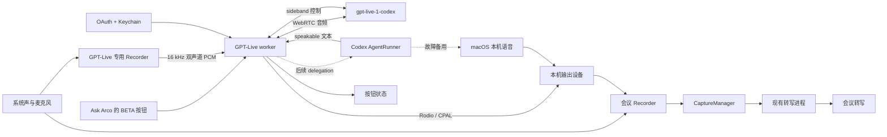

# PRD：Arco GPT Live 会议语音助手（Beta）

- 状态：Beta；按钮连接、设置页 OAuth 和会议进度 delegation 已实现，“Hey Arco”后续实现
- 日期：2026-09-04
- 适用产品：Arco macOS
- 相关文档：[产品说明](../PRODUCT.md)、[桌面端架构](ARCHITECTURE.md)、[转写实现](TRANSCRIPTION.md)

## 1. 直接结论

产品方向确定为借鉴 OpenClaw 的做法：Arco 自己完成 ChatGPT OAuth，直接建立 `gpt-live-1-codex` WebRTC 会话。第一版让用户先在设置页连接 ChatGPT，再在会议中的“询问 Arco”标题旁点击 `BETA` 语音按钮。连上后，语音模型持续听会议音频；会议进度、决定和待办等问题通过 sideband 交给当前会议 Agent 查询即时转写，再由 GPT-Live 说出结果。“Hey Arco”唤醒延后实现。

这项功能明确标为 **Beta**，默认关闭。升级 Arco 不会自动开启它。用户不开启时，现有会议录音、转写和文字 Ask Arco 不会改变；即使 Beta 语音进程失败，也不能停止现有会议流程。

当前 Beta 交互是：

> 用户开始会议录音 → 在“询问 Arco”标题旁点击“语音提问 BETA” → 按钮显示“正在听” → 用户直接提问 → GPT-Live 从 Mac 当前输出设备回答 → 再次点击或停止会议即断开。

后续目标才是：

> 用户说“Hey Arco” → Arco 本地识别唤醒词 → GPT-Live 回答，或把复杂问题交给 Codex → GPT-Live 用自然语音说出最终答案。

这条路径有完整的 OpenClaw 源码可以验证协议细节，也适合 Arco 现有的录音和 Agent 实现。它不需要 OpenAI Platform API Key，目标是使用用户的 ChatGPT/Codex OAuth 账号。Arco 不照搬 OpenClaw 的 TypeScript、Gateway 或运行时，而是按现有 SwiftUI + Rust 进程分工接入成熟库。Arco 不自己实现 WebRTC 协议栈或 Opus 编解码器。

风险也必须说清楚：本文固定参考的 OpenClaw 提交调用 `chatgpt.com/backend-api/codex/realtime/calls`，并发送 `OpenAI-Alpha: quicksilver=v2`。OpenClaw 当前 `main` 分支的 Talk 文档已经改成原生 `api.openai.com/v1/live`，并明确说旧的 ChatGPT backend 路由会返回 403。OpenAI 公共文档仍没有把 `gpt-live-1-codex`、旧 URL 或相关事件格式写成稳定 API。Arco 当前账号实测旧路径可用，说明不同账号、版本或灰度可能出现差异；因此实现必须保持独立 Beta、失败可见、可随时关闭，不能把任一份 OpenClaw 代码当成长期接口承诺。

2026-09-03 的真实试验也确认了一个协议变化：服务会在没有 `session.started` 的情况下直接发送 `output_transcript.added`、`turn.created` 和 `turn.delta`。如果仍把 `session.started` 当唯一就绪信号，客户端会把已经开始回答的会话误报成超时。Arco 没有把 `session.usage.updated` 猜成成功，而是要求收到本轮指定的助手 transcript，并同时收到连续至少 100 ms、高于 -50 dBFS 的远端 PCM。修正后，当前账号已经完成真实 `gpt-live-1-codex` 可听语音往返。

方案优先级改为：

| 模式 | 用途 | 产品位置 |
| --- | --- | --- |
| ChatGPT OAuth + `gpt-live-1-codex` | 目标实现 | 主路径 |
| Codex 订阅 + macOS 本机语音 | GPT-Live 不可用时继续完成语音问答 | 故障备用 |
| 公共 OpenAI Realtime | 将来需要正式公开接口时使用 | 可选备用，会产生 API 费用 |

如果真实试验失败，产品不能假装成功并静默切换收费接口。Arco 应说明 GPT-Live 当前不可用，再让用户主动选择是否使用备用模式。

## 2. OpenClaw 是怎么做的

本次检查基于 OpenClaw 提交 `f257d062beb8b59ee163eee4b0916f86a5a4d091`。

### 2.1 它没有直接复用 Codex CLI 登录

OpenClaw 要求用户在 OpenClaw 内单独完成 OpenAI OAuth。其文档明确说明，它不会读取现有的 `~/.codex` 登录。这样做可以让 OpenClaw 自己刷新令牌、取得 `chatgpt-account-id`，并把令牌留在 Gateway 上。

它使用标准的 OAuth Authorization Code + PKCE 流程：`S256` challenge、本机 `localhost:1455/auth/callback` 回调、`openid profile email offline_access` scope，然后在 `auth.openai.com/oauth/token` 交换和刷新令牌。Arco 的技术试验会使用相同参数，并把 `originator` 改为 `arco`。

OpenClaw 源码内带有一个公开 client ID。它是不是允许 Arco 作为另一款产品长期使用，OpenAI 官方文档没有说明。技术试验可以验证兼容性；正式发布前必须确认客户端身份的使用方式。无论如何，新语音进程都不能直接读取 Codex 的 `auth.json`。access token、refresh token、过期时间和 account ID 应由 Rust 凭证模块写入 macOS Keychain。

### 2.2 它有两种 WebRTC 运行方式

OpenClaw 没有自己实现完整的 WebRTC 协议。它按运行位置分成两种方式：

- 浏览器 Talk：浏览器使用原生 `RTCPeerConnection`。Gateway 只保管 OAuth token、代浏览器交换 SDP，并维持 sideband；音频直接在浏览器和 GPT-Live 之间传输。
- Gateway Relay：没有浏览器 WebRTC 时，Gateway 使用 `werift` 处理 PeerConnection、ICE、DTLS、SRTP 和 RTP，使用 `libopus-wasm` 处理 Opus。OpenClaw 自己只补 PCM 转换、缓冲、RTP 乱序处理和进程生命周期。

Arco 是本机应用，产品形态更接近 Gateway Relay，但没有理由复用它的 TypeScript 和 WebAssembly 依赖。Arco 应使用 Rust WebRTC 和 Opus 库完成同样的媒体工作，只保留自己的会议音频适配、状态和错误处理。

### 2.3 GPT-Live 负责对话，Agent 负责复杂工作

OpenClaw 为 GPT-Live 会话设置 `delegation: { type: "client" }`。当语音模型需要外部信息或更复杂的推理时，会发出 `delegation.created`。Gateway 随后调用配置好的 Agent，再通过 `delegation.context.append` 把一段适合朗读的结果交还给语音会话。

这比让两个模型同时回答更清楚：

- GPT-Live 负责听、说、打断和简短对话。
- Codex 负责读取当前会议上下文、推理和使用工具。
- 最终答案回到 GPT-Live，由它自然地说出来。

Arco 应保留这个分工。GPT-Live 遇到需要会议事实、推理、当前信息或工具的请求时，只能创建一个 Codex Agent 请求；Codex 的结果通过 `speakable` channel 返回，GPT-Live 再用自然语言说出来。

### 2.4 它在 macOS 上如何识别唤醒词

OpenClaw 的 macOS Voice Wake 并不是一个只识别固定声学特征的传统唤醒词模型。它持续运行 Apple 的本地语音识别，然后在识别文本中匹配触发词。命中后显示浮层，继续收集问题，并在静音后自动提交。

这个方案实现快，也允许自定义名称，但会持续占用语音识别资源。Arco 已经在会议中持续转写，所以首版可以直接检查麦克风声道的实时转写，不必再打开第二个麦克风采集器。后续如果需要在未录制会议时也能唤醒，再增加独立的本地识别进程。

### 2.5 已确认、观察到和仍需实测的内容

| 内容 | 依据 | 判断 |
| --- | --- | --- |
| Codex CLI/App Server 支持用 ChatGPT 登录并使用订阅 | OpenAI 官方 Codex 文档 | 已确认 |
| 公共 Realtime 支持实时音频、WebRTC 和 WebSocket | OpenAI 官方 API 文档 | 已确认 |
| 公共 Realtime 使用 Platform API Key 和 API 计费 | OpenAI 官方 API 文档 | 已确认 |
| OpenClaw 源码会用 ChatGPT OAuth 请求 Codex GPT-Live 路由 | OpenClaw 源码 | 已观察到 |
| `webrtc-rs` 能在当前 Mac 完成 offer/answer、ICE、Opus RTP 发送和解码 | Arco 本地回环测试 | 已实测 |
| OAuth PKCE、回调校验、token 刷新解析和 Keychain 存储代码能编译并通过假 transport 测试 | Arco 自动测试 | 已实测 |
| 当前账号能完成 Arco 自有 OAuth，token 交换成功且凭证只写入 Keychain | 2026-09-03 真实账号试验 | 已实测 |
| 当前账号能请求 `gpt-live-1-codex` 并得到 HTTP 201、有效 SDP answer 和 call ID | 2026-09-03 真实账号试验 | 已实测 |
| sideband 能通过 HTTP CONNECT 代理完成 WebSocket upgrade | 2026-09-03 真实账号试验 | 已实测 |
| 临时打开 Clash TUN 后，HTTPS、WSS 和 WebRTC 使用同一美国出口，WebRTC 状态能到 `connected` | 2026-09-03 真实账号试验；测试后已恢复 TUN 关闭 | 已实测 |
| 使用 OpenClaw 的 `werift` 0.24.4、Codex 订阅凭证、请求头和调用顺序也没有收到 `session.started` | 2026-09-03 对照试验 | 已实测，说明不能把该事件当作唯一就绪信号 |
| `gpt-live-1-codex` 对任意 Codex 订阅账号都可用 | 没有公开承诺 | 未确认 |
| 该非公开路由会长期保持 URL、请求头和事件格式不变 | 没有公开承诺 | 不应假设 |
| 当前用户账号能完成一轮真实语音往返 | HTTP 201、WebRTC `connected`、指定助手 transcript、连续至少 100 ms 且高于 -50 dBFS 的解码 PCM | 已通过 |

## 3. 用户问题

用户在开会时往往没有空输入长问题。按钮版先减少输入成本，并验证长连接、音频和回答是否稳定；它仍要求用户点一次 Arco 浮窗或主窗口。确认稳定后再增加免手唤醒。

- “Hey Arco，刚才对方承诺的交付时间是什么？”
- “Hey Arco，这个方案最大的风险是什么？”
- “Hey Arco，帮我用一句话回答他刚才的问题。”
- “Hey Arco，我们还有哪一个问题没有讨论？”

Arco 应短暂显示自己正在听、正在思考或正在说话，并把答案读给本机用户。答案同时进入当前会议的 Ask Arco 对话，用户之后可以检查文字和实际发送的会议内容。

## 4. 产品目标

### 4.1 当前按钮版目标

- 只在 Arco 正在录制会议时显示连接按钮，打开页面本身不能发送音频。
- 点击后按当前会议的 `both`、`system` 或 `mic` 音频模式发送音频。
- 通过 Arco 自己的 ChatGPT OAuth 登录建立 `gpt-live-1-codex` 会话，不要求用户提供 Platform API Key。
- GPT-Live 直接处理普通实时对话；会议事实、进度、决定和待办问题通过 client delegation 交给当前配置的 Codex 或 Claude Agent。
- 用户可以连接、取消连接、重试和主动断开；停止会议或关闭 Beta 会自动断开。
- 网络、认证或语音后端失败时，会议录制和转写不能中断。

### 4.2 当前按钮版不做

- 不做“Hey Arco”唤醒。
- 暂不把语音问题和回答写入文字 Ask Arco 历史。
- 不在 Arco 未录制时持续监听房间。
- 不把 Arco 的声音注入 Zoom、飞书会议或 Teams 的虚拟麦克风。首版只从 Mac 当前输出设备播放。
- 不通过语音直接发送消息、修改文件、创建任务或执行其他有外部影响的动作。
- 不做声纹识别。房间里能被本机麦克风听到的人，都可能说出唤醒词。
- 不承诺未公开的 GPT-Live OAuth 路径长期可用。

## 5. 用户体验

### 5.1 设置

在 Settings → GPT Live 增加独立的“GPT Live 语音助手”页面：

- 开关：默认关闭，由用户主动打开。
- 唤醒词：首版固定为 `Hey Arco`，以后再允许自定义。
- ChatGPT 连接：显示检查中、未连接、连接中、已连接和失败状态；提供连接、重新登录和断开按钮。
- 语音模型：首版固定为 `gpt-live-1-codex`，不让用户输入任意模型名称。
- 声音：只显示实际探测成功的 voice，初始使用 OpenClaw 已验证过的 `spruce`。
- 备用方式：默认关闭。用户可以主动选择 `Codex + 本机语音`；公共 OpenAI Realtime 留到后续版本。
- 输出设备：跟随系统，首版不单独选择。
- 回答长度：简短 / 正常，默认简短。

设置页必须明确说明：该功能使用 ChatGPT OAuth 和当前账号的 GPT-Live 访问资格；接口目前没有公开稳定文档，可能因账号或服务变化而不可用。Arco 不能把失败描述成“余额不足”，除非服务端明确返回这一原因。

### 5.2 当前按钮版的一次完整交互

1. 用户在 Settings → GPT Live 连接 ChatGPT，并主动开启 GPT Live Beta。
2. 用户开始会议录制并打开“询问 Arco”。
3. 主窗口和浮窗标题旁显示“语音提问 BETA”。
4. 用户点击按钮。按钮先显示“取消连接”，连上后显示“正在听”。
5. 用户直接说问题。普通问题由 GPT-Live 直接回答；会议进度类问题先读取当前会议即时转写。
6. GPT-Live 从当前输出设备回答。
7. 用户再次点击按钮即可断开；停止会议、断开 ChatGPT 或关闭 Beta 也会立即结束会话。

当前状态依次为：

```text
未连接 → 正在连接 → 正在听
   ↑         │          │
   └──── 取消/失败/主动断开 ────┘
```

### 5.3 回答播放范围

首版答案从 Mac 当前输出设备播放。如果用户使用外放，房间里的人可能听到；如果是在线会议，麦克风也可能再次收到外放声音。设置页和首次启用说明应建议使用耳机。

按钮版会启动一条 GPT-Live 专用录音。它只从自身上行中排除 GPT worker 播放的回答，避免模型把自己的话再次当成问题。Arco 原有的会议录音不设置这个排除，因此 GPT 回答仍会像参会者发言一样进入会议录音和转写。会议转写会根据声道、起止时间和相似文本去掉“系统音频 + 麦克风”产生的同一次回声，也会拦截服务商重复提交的同声道 final segment；不同时间的真实重复发言仍然保留。使用外放时仍建议戴耳机，以减少声学回声对识别质量的影响。

## 6. 功能要求

### F1. 启用和生命周期

- 语音助手只依附当前活动会议，不创建第二个会议。
- 捕获状态变为 `recording` 后才进入等待唤醒。
- 停止、崩溃恢复、权限撤销或音频设备切换失败时，关闭语音会话并释放播放资源。
- 语音失败不改变会议捕获状态。

### F2. 唤醒识别

- 首版从麦克风声道的实时识别结果中匹配句首 `Hey Arco`，忽略大小写和常见标点。
- 系统声道中的同一句话不能触发。
- 命中后从问题文本中去掉唤醒词。
- 只说唤醒词而没有问题时，5 秒后取消。
- 保留全局快捷键作为无障碍和嘈杂环境下的替代入口。

### F3. 问题收集

- 命中唤醒词后继续收集本机麦克风内容，直到模型确认约 700 毫秒静音。
- 单个问题最长 30 秒；超时后提交已识别内容，空内容则取消。
- 如果识别结果仍在修订，等待最终结果或最多再等 1 秒。
- 收集问题期间不把远端系统声道拼进用户问题。

### F4. 会议上下文

- GPT-Live 建会话时只取得语音行为说明、会议标题、参与者、当前议题和最近几轮对话，不取得整场会议转写或文件内容。
- GPT-Live 的 `initial_items` 最多 16 条、单条最多 800 个字符、合计最多 8,000 UTF-8 bytes；Arco 默认应比上限更少，只放最近 2—4 轮有用对话。
- Codex 收到 delegation 后，默认取得问题发生前最近 90 秒的最终转写，以及当前会议已确认的标题和附件说明。
- 如果问题明确提到“整场会议”“一开始”或“所有决定”，Codex 沿用现有 Agent 的会议上下文限制，并在答案中显示实际发送范围。
- 不允许语音模式静默添加工作区、用户主目录或其他会议记录。

### F5. 推理和朗读

- 每个会议只允许一个活动 GPT-Live 会话和一个活动语音问题。
- 第一次命中唤醒词时立即开始 WebRTC 握手，并与用户继续说问题并行进行；等待唤醒时不发送麦克风音频。
- 一轮回答完成后可以暂时保留会话，但必须禁用麦克风 track；会话到期、会议停止或网络改变时重新建立。
- 新问题到来时取消旧的未播报答案；已经保存的 Agent 消息不删除。
- 默认提示要求先说直接答案，并尽量在 30 秒内读完。
- GPT-Live 负责说话；需要会议事实、推理、当前信息或工具时，只能委托一次 Codex Agent，避免重复回答。
- Codex 结果通过 `delegation.context.append` 的 `speakable` channel 返回，单次返回长度必须受限并支持安全分块。
- 备用本机语音模式把 Codex 的流式文本按完整句子送入系统语音，不能逐 token 朗读。

### F6. 打断和取消

- 用户说话或点击停止时，立即停止本地播放，并取消仍在生成但不再需要的回答。
- 播报过程中忽略扬声器回声产生的 `Hey Arco`。
- 如果用户明确再次说“Hey Arco”，停止当前回答并开始新问题。

### F7. 错误处理

- Codex 不可用：显示可读错误，保留问题草稿，不切换到另一个 Agent。
- 公共 Realtime 不可用：允许用户切到本机语音；不能静默产生另一种费用。
- GPT-Live 返回 401、403、模型不存在或协议解析失败：本次停止并说明原因；设置中把连接状态标为不可用或需要重新登录。
- 任一语音错误都不得停止录音器、转写器或当前会议。

### F8. 保存和隐私

- 保存问题、文字答案、时间、所用后端和上下文说明；不保存原始唤醒音频副本。
- 等待唤醒时不向新的云服务发送额外音频。本来已启用的云转写仍按用户现有设置工作。
- OAuth access token、refresh token、过期时间和 account ID 存入 macOS Keychain，不写入设置 JSON、日志或崩溃报告。
- OAuth 登录由 Arco 自己管理，不能读取或导出 Codex 的原始 `auth.json`。
- 如果以后增加公共 Realtime，Platform API Key 也必须存入 Keychain，并与 ChatGPT OAuth 凭证分开。

## 7. 技术设计

### 7.1 复用现有实现

Arco 当前录音器输出 16 kHz、Int16、双声道 PCM：声道 0 是系统输出，声道 1 是本机麦克风。Rust `CaptureManager` 已经把同一份音频发送给所选的转写和说话人识别进程。`AgentRunner` 已经能通过 `codex exec --json` 创建和恢复 Codex 会话。

新增功能应继续遵守现有进程分工：SwiftUI 只显示状态，Rust 决定生命周期，长连接和音频处理放在受管理的工作进程中。



### 7.2 新增 Rust 组件

当前由 Swift `GPTLiveSessionModel` 和独立 Rust worker 分别负责：

- Swift 只允许在活动会议中启动，并处理连接、取消、断开、失败和迟到启动结果。
- Rust worker 管理 OAuth 刷新、WebRTC、sideband、专用 recorder 和播放资源。
- 在语音错误时保住会议录制。
- 向 SwiftUI 发送有限的状态事件，不发送凭证。

建议状态数据：

```json
{
  "type": "status",
  "state": "connecting|connected|speaking|disconnecting|error",
  "error": null
}
```

### 7.3 唤醒实现

首版采用“转写文本触发”：

- 在转写适配层保留声道来源。
- 只检查本机麦克风声道的临时或最终结果。
- 用有限状态解析器匹配句首唤醒词，处理结果修订、重复 final 和断线重放。
- 命中事件带转写片段 ID，确保重放不会触发第二次。

独立本地唤醒进程作为后续选项。它从 `CaptureManager` 取得麦克风 PCM，可以使用 Apple Speech 的本地识别，或者固定关键词模型。它不能自行再次打开麦克风，否则会与现有 AVAudioEngine 生命周期冲突。

### 7.4 ChatGPT OAuth

新增 `gpt_live_credentials` Rust 模块，沿用 Arco 现有 Keychain 模块的写法。SwiftUI 只能取得连接状态、账号显示名和套餐类型，永远不能取得 token。

OAuth 流程按 OpenClaw 当前源码实现：

1. 生成随机 `state` 和 PKCE verifier/challenge，算法固定为 `S256`。
2. 打开 `https://auth.openai.com/oauth/authorize`，scope 使用 `openid profile email offline_access`。
3. 只在 loopback 地址监听 `localhost:1455/auth/callback`；验证 state 后立即关闭监听器。
4. 向 `https://auth.openai.com/oauth/token` 交换 access token、refresh token 和过期时间。
5. 从 token 中取得 `chatgpt-account-id`，并和令牌一起存入 Keychain。
6. 到期前刷新；遇到 refresh token reused、expired、invalidated 或 revoked 时清除内存副本，并要求用户重新登录。

技术试验参考 OpenClaw 当前公开的 OAuth 参数，把 `originator` 明确写为 `arco`，不把请求伪装成 OpenClaw。public client ID 是否可以被另一款产品长期使用仍记为发布风险；P0 可以先验证技术兼容性，正式发布前再确认客户端身份。

### 7.5 GPT-Live 会话与 sideband

新增原生 `arco-gpt-live` 工作进程，不引入 Node、OpenClaw Gateway、`werift` 或 `libopus-wasm`。这里的“原生工作进程”只是 Rust 适配程序，不是自己编写 WebRTC。PeerConnection、ICE、DTLS、SRTP、SCTP、RTP 和 Opus 都交给现成库；Arco 只负责把现有 PCM 接进去、转发会话事件、控制取消和清理资源。

#### 7.5.1 库选择

首选组合如下：

| 工作 | 首选库 | 使用方式 |
| --- | --- | --- |
| PeerConnection、SDP、ICE、DTLS、SRTP、RTP、DataChannel | [`webrtc` 0.20.4](https://crates.io/crates/webrtc/0.20.4) | 使用默认 Tokio runtime；版本在 `Cargo.lock` 中固定，不跟随未验证的小版本自动升级 |
| PCM 与 Opus 的编码和解码 | [`opus-pure` 0.2.1](https://crates.io/crates/opus-pure/0.2.1) | 纯 Rust 实现，当前回环测试已覆盖编码、RTP 传输和解码；Beta 期间继续用真实会议检查音质、丢包恢复和兼容性 |
| 16 kHz PCM 转 Opus 输入 | `opus-pure` 的 16 kHz encoder | recorder 原生输出正好是 Opus 支持的采样率，不再自己写重采样；RTP 时间戳仍按 Opus 48 kHz 时钟处理 |
| sideband WebSocket | `tokio-tungstenite` 0.26 + `async-http-proxy` 1.2.5 | WebSocket 和 HTTP CONNECT 交给库；Arco 只解析固定目标、代理配置和 GPT-Live 事件 |
| 本机播放 | [`rodio` 0.22.2](https://docs.rs/rodio/0.22.2/rodio/) + CPAL | 跟随系统默认输出设备播放解码后的 PCM；不让 WebRTC 库再次打开麦克风 |

`webrtc` 的 `TrackLocalStaticSample` 可以接收已编码的 Opus frame，并由库完成 RTP 分包和序号管理。远端音频经库提供的 track 读取，再交给 Opus 库解码。Arco 可以有一个很小的、有上限的播放缓冲区，但不自行实现 ICE/STUN/TURN、DTLS、SRTP、SCTP、RTP 包格式、重传协议或 Opus 算法。当前本机测试已经让两个库创建的 peer 完成 ICE 连接，并真实交换和解码一帧 48 kHz 双声道 Opus 音频。

真实账号早期试验发现了一个本地回环测不到的网络风险。OAuth、SDP 和 sideband 都是 HTTPS/WSS，可以走 macOS 的 HTTP 代理；WebRTC 媒体主要使用 UDP，不会自动经过 HTTP 代理。信令和媒体使用不同出口时，ICE 可能超时。

在用户明确允许后，早期试验曾临时打开 Clash TUN，并在测试后恢复关闭。2026-09-03 的打包同款 worker 复测没有打开 TUN，也成功进入 `connected`，通过系统声音发送测试问题，并收到 `speaking` 远端音频事件。因此这里是需要诊断的网络风险，不是产品必须自动改 VPN 的前置条件。私有服务也不一定发送 `session.started`，而会直接开始输出 transcript 和 turn 事件。Arco 的探针因此同时检查本轮指定 transcript 和真正解码出的可听 PCM；不能用 `session.usage.updated`、连接状态或非空音频包单独判定成功。

远端接收还需要处理 OpenAI answer 不声明 SSRC 的情况。Arco 在应用 SDP answer 后直接挂到 audio transceiver 的默认 receiver track，同时保留普通 `on_track` 回调，并用原子标记避免重复读取。这一点和 OpenClaw 当前媒体实现的处理方式一致；本地集成测试会删除 answer 中的全部 `a=ssrc:` 行，再强断言仍能解码对端发送的 Opus。

Beta 启动探测必须识别这类分流：如果 HTTPS 出口可用但 WebRTC 长时间无法启动，要提示“媒体网络未连通”，不能误报为账号不支持。位于 OpenAI 不支持地区的用户需要让 UDP 与 HTTPS 使用同一受支持出口，例如用户主动开启 VPN/TUN。Arco 不应自行修改系统代理或 VPN。企业网络则应提供允许 UDP 的出口或可用 TURN；HTTP CONNECT 只能覆盖 OAuth 和 sideband，不能代替 TURN。

首版固定 `webrtc` 0.20.4，不跟随上游版本自动升级。只有新版本通过 SDP、ICE、RTP、打断和打包测试后才能更新。

P0 已把新媒体程序放在独立的 `rust/arco-gpt-live` crate，并声明 Rust 1.88。现有 `arco-core/Cargo.toml` 仍声明 Rust 1.77.2，新媒体依赖没有加入它。当前机器使用 Rust 1.92.0，两套 crate 的相关测试都已通过。用已安装的 Cargo 1.77.2 做反向检查时，仓库原有 lockfile 中的 `idna_adapter` 1.2.2 已经因为 Rust 2024 manifest 无法被旧 Cargo 解析；本次 lockfile 没有改变这个依赖版本。因此，不能宣称当前整个 core 依赖集仍能用 Cargo 1.77.2 构建，这个已有的最低版本问题应单独修正。CI 和正式打包机需要为新 worker 提供 Rust 1.88 或更新版本。

最初试用 `opus` 0.4.0 时，它的默认 bundled 构建在当前干净环境要求 CMake，实际编译失败。系统虽然已安装 Homebrew `libopus`，但依赖它会让用户机器和打包机出现差异。因此代码改用 `opus-pure` 0.2.1。它不需要 CMake、Homebrew 动态库或 C FFI；代价是库较新，必须把真实会议音质、丢包恢复和 CPU 占用列为 Beta 测试重点。

如果 P0 发现 `webrtc` 仍要求 Arco 自己维护较多的音频丢包恢复、抖动缓冲或 RTP 细节，就停止继续补协议代码，改用 [`shiguredo_webrtc`](https://github.com/shiguredo/webrtc-rs) 提供的 Google libwebrtc Rust 绑定。它带完整的音频 codec factory 和 audio processing，但代价是 Rust 1.93、预编译静态库、更大的 App 体积和更复杂的签名检查。因此它是第二选择，不是首选。

#### 7.5.2 初始上下文和动态补充

建会话时的 `session` 同时承载三类信息：

- `instructions`：说明 GPT-Live 是实时语音层、没有工具、何时创建 delegation，以及回答长度和会议礼仪。
- `initial_items`：最近少量用户和助手消息。用户消息使用 `input_text`，助手消息使用 `output_text`。
- `delegation: { type: "client" }`：要求 GPT-Live 通过 sideband 把需要外部处理的任务交给 Arco。

会话开始后，短小的会议信息可以用 `session.context.append` 的 `commentary` channel 补充；Codex 完成任务后，用 `delegation.context.append` 的 `speakable` channel 返回可朗读结果。GPT-Live 不应持有完整会议转写、附件正文、工作区或 Codex 的工具上下文。这些内容留在 Agent 侧，只有实际发生 delegation 时才按当前权限读取。

会话建立按以下协议执行：

1. 创建 WebRTC offer。
2. 构造 session：模型固定为 `gpt-live-1-codex`，voice 初始为 `spruce`，设置 `delegation: { type: "client" }`，加入 Arco 语音层说明和受限的 `initial_items`。
3. `POST https://chatgpt.com/backend-api/codex/realtime/calls?intent=quicksilver&architecture=avas`，JSON body 为 `{ "sdp": "...", "session": { ... } }`。
4. 请求携带 Bearer token、`chatgpt-account-id`、`OpenAI-Alpha: quicksilver=v2`，以及每次新建的 session/thread/request ID。
5. 限制 SDP answer 大小并验证非空；从 `Location` 或 `openai-session-id` 取得只含安全字符的 call ID。
6. 连接 `wss://api.openai.com/v1/live/{call-id}` sideband，使用同一组认证和请求 ID。
7. 最多重试五次 sideband 启动，使用递增等待；连接失败时关闭 peer 和本轮音频。

Arco 至少要解析这些事件：

| 事件 | Arco 的处理 |
| --- | --- |
| `session.started` | 如果服务端发送则记录过期时间；不能作为唯一就绪信号 |
| `input_transcript.added` | 更新用户问题的临时文本 |
| `output_transcript.added` | 更新回答临时文本 |
| `turn.done` | 固化本轮文字并保存到 Agent 会话 |
| 远端音频 track / `output_audio.delta` | 以 P0 实际返回为准，解码后放入有上限的播放缓冲区 |
| `delegation.created` | 取消旧委托，调用一次 Codex Agent |
| `error` | 区分认证失败和会话失败，清理资源 |

对未知事件可以记录类型后忽略，但关键字段缺失、音频载荷超限或非法 call ID 必须立即结束会话。日志不能保留完整 SDP、token、account ID 或服务端未清理的错误正文。

### 7.6 Codex 委托和故障备用

GPT-Live 的系统说明应明确告诉模型：它没有自己的工具；凡是需要会议事实、推理、当前信息或动作的请求，都要委托给 client。sideband 收到 `delegation.created` 后：

1. 组合委托输入和本轮最近的语音对话，不把整个会话重复发送。
2. 加入当前会议最近 90 秒的最终转写和用户可见的上下文说明。
3. 调用现有 `AgentRunner` 并恢复当前会议的 Codex session。
4. 新委托到达时取消旧委托，只保留最新一个待处理请求。
5. 将结果限制在 1,800 个字符内，再按最多 500 UTF-8 bytes 分块，以 `speakable` channel 发回。

首版不为了语音同时重写全部 AgentRunner。后续可以迁移到官方 Codex App Server，以获得托管 ChatGPT 登录、令牌刷新、Agent 事件和会话管理。

如果 GPT-Live 不可用，Arco 保留“Codex + macOS 本机语音”备用项。它只能由用户主动选择；应用不能自动切换到公共 Realtime 并产生 API 费用。

### 7.7 从 OpenClaw 借鉴什么

Arco 借鉴协议事实、异常处理经验和测试场景，不复制整套源码。固定上游提交 `f257d062beb8b59ee163eee4b0916f86a5a4d091`，便于以后确认协议是否变化。

| OpenClaw 参考 | Arco 自己实现的内容 |
| --- | --- |
| PKCE、loopback callback、token refresh | Rust OAuth/Keychain 模块和独立的 Beta 设置值 |
| model、voice、请求 URL 和认证头 | Rust 类型、白名单和 HTTP client |
| SDP 与 call ID 的限制 | Arco 自己的校验和错误脱敏 |
| sideband 启动、重试和早期消息上限 | Rust WebSocket 客户端和有上限的队列 |
| Opus 与 RTP 的媒体行为 | 用 `webrtc`、`opus-pure` 和已有 `rubato` 接入；Arco 只写适配代码 |
| 最新 delegation 优先和 `speakable` 返回 | `VoiceAssistantManager` 与现有 `AgentRunner` 的适配 |
| 语音层没有工具、复杂工作交给 Agent | Arco 自己的会议语音提示 |

不采用 OpenClaw 的 Gateway 浏览器 offer broker、CORS、多租户 session limit、Discord、电话和视频代码。Arco 是本机单用户应用，Rust 已经管理凭证和工作进程，不需要再建一层本机 HTTP Gateway。

如果实现中确实复制了非简单代码片段或测试样本，再按 MIT License 保留对应版权和许可说明；仅参考协议和行为时，在技术文档中保留来源链接和固定提交即可。

### 7.8 2026-09-03 已实现的按钮版

当前代码已经包含：

- `arco-core/src/gpt_live.rs`：固定的 model、voice、请求 URL、认证头、session、call ID、sideband URL、事件解析、上下文上限和错误脱敏。
- `arco-core/src/gpt_live_oauth.rs`：PKCE、严格 loopback callback、token 交换与刷新、JWT 账号信息解析、凭据校验和 macOS Keychain 存储。
- `rust/arco-gpt-live`：`webrtc-rs` peer、`opus-pure` 编解码、16 kHz recorder 输入、Rodio/CPAL 播放、sideband 监控、可停止的产品 worker，以及一个不会自动联网的命令行探针。
- Settings → GPT Live：使用独立侧边栏入口，显示 `BETA` 标签、默认关闭的开关、ChatGPT 连接状态，以及连接、重新登录和断开按钮；OAuth token 仍只保存在 Keychain。
- 主窗口和浮动 Ask Arco：只在活动会议中显示按钮，覆盖未连接、连接中可取消、已连接、断开中和失败重试状态；打开窗口不会自动发送音频。
- 生命周期：关闭 Beta、停止会议或退出 App 都会结束 GPT Live；连接失败不会停止会议录音。
- 录音：GPT 专用 recorder 会排除 worker 自己的播放，避免自我回灌；原会议 recorder 保留回答，并在即时快照和最终落盘前去除跨声道声学回声与重复 final segment。
- 会议查询：sideband 收到 client delegation 后，AgentRunner 每次重新读取当前 Markdown 和 `.live.json`，把适合朗读的结果通过 `delegation.context.append` 返回；停止语音会取消仍在运行的 Agent 子进程。
- 播放：远端 RTP 使用 4 包乱序缓冲、80 ms 等待、Opus 丢包隐藏和约 60 ms 播放预缓冲，降低短暂网络抖动造成的卡音。
- 打包：`arco-gpt-live` 作为签名 helper 进入 `Arco.app`，原生边界检查要求它存在、架构一致且签名标识正确。
- 根目录 `make test`：会运行新的 GPT Live crate 测试；`make gpt-live-probe` 只跑本机媒体回环，不访问 OpenAI。

开发探针命令如下：

```bash
# 不联网，只验证本机 WebRTC/Opus
make gpt-live-probe

# 以下命令会打开 OpenAI 登录页并把凭据存入 macOS Keychain
cargo run --manifest-path rust/arco-gpt-live/Cargo.toml --bin arco-gpt-live-probe -- login
cargo run --manifest-path rust/arco-gpt-live/Cargo.toml --bin arco-gpt-live-probe -- status

# 会真实调用未公开的 ChatGPT GPT-Live 路由；固定确认值用于避免误执行
cargo run --manifest-path rust/arco-gpt-live/Cargo.toml --bin arco-gpt-live-probe -- \
  live --ack gpt-live-beta-private-api
```

目前已经完成真实 OAuth、HTTP 201、SDP answer、call ID、sideband WebSocket、会议音频持续送入、WebRTC connected、远端 Opus 解码、本机播放、按钮生命周期、worker 签名和 App 打包。产品 worker 的真实复测通过了“系统声音提问 → GPT Live → 远端音频播放”，本轮不需要临时打开 TUN。

还没有完成：回答写入文字 Ask Arco、语音打断，以及 `Hey Arco` 触发。因此当前可以称为“按钮连接的会议语音 Beta”，不能称为完整的免手会议 Agent。

## 8. 技术可行性评估

| 部分 | 现有基础 | 预计新增工作 | 判断 |
| --- | --- | --- | --- |
| 会议内唤醒 | 已有持续转写和独立麦克风声道 | 来源保留、文本匹配、防重放 | 可行，风险低 |
| 问题收集 | 已有实时 ASR 和 VAD | 新状态和问题片段组装 | 可行，风险低 |
| Codex 订阅推理 | 已有 Codex CLI 会话、流式 JSONL | 增加语音请求类型和取消 | 可行，风险低 |
| ChatGPT OAuth | OpenClaw 有完整 PKCE 和刷新实现；Arco 已有 Keychain 模块 | 登录回调、刷新、状态和安全清理 | 可实现，发布资格待确认 |
| GPT-Live WebRTC | OpenClaw 有会话创建代码；Rust 有成熟 WebRTC/Opus/播放库 | 长会稳定性、设备切换和打断 | 传输、会议音频输入和可听语音往返均已通过真实账号验证 |
| GPT-Live sideband | OpenClaw 有事件解析和委托实现 | 长会并发与更多异常实测 | 会议进度 delegation 已接入；不能依赖 `session.started`，私有事件仍有变化风险 |
| 本机语音备用 | macOS 原生能力 | 播放队列、句子切分、打断 | 可行，风险低 |
| 回声控制 | GPT 专用 recorder 排除 worker 播放，会议 recorder 保留回答；麦克风支持 voice processing | 声学回声、耳机提示、实机测试 | 可行，风险中等 |
| 公共 Realtime 备用 | 官方接口和文档完整 | Platform Key、工作进程、计费说明 | 可行，但不做首版 |
| 把声音送进会议软件 | 当前没有虚拟音频设备 | 音频驱动、路由、签名和权限 | 不纳入首版 |

当前机器是 macOS 27.0，满足 OpenClaw 文档中 macOS 26+ 的 Apple Speech 前提。当前 ChatGPT.app 内置 Codex `0.151.0-alpha.7.2`，本机账号显示为 ChatGPT 登录。Shell PATH 中另一个 npm Codex 缺少平台二进制；Arco 必须继续使用自己的可执行文件解析逻辑，不能假设 PATH 中第一个 `codex` 一定可用。

## 9. 实施顺序和测试设计

以下工期是一个熟悉现有 Arco 代码的 macOS/Rust 工程师的粗略估计，不包括等待 OpenAI 开通账号或确认接口许可的时间。

### P0：GPT-Live 账号与协议试验，已完成

核心连接只做独立试验程序，不接入会议录音主流程。设置页只增加明确的 Beta 标记和默认关闭的加入开关。真实请求会使用账号和额度，并调用未公开接口，执行前需要用户明确同意。

要验证：

- Arco 合法取得的 OAuth 身份能否创建 `gpt-live-1-codex` WebRTC 会话。
- SDP、call ID、公开 sideband 和语音往返是否都成功。
- delegation 是否真的可用留到 P2，不作为直答连接试验的完成条件。
- 403 是账号、voice、model 还是路由问题。
- `webrtc` 0.20.4、`opus-pure` 0.2.1 和 macOS arm64 打包能否在 Rust 1.88 或更新版本下稳定编译。
- 正常网络、乱序、丢包和网络切换时，库提供的媒体处理是否够用；如果需要自己补大量 RTP 或抖动缓冲代码，改用 libwebrtc 绑定。

测试设计：

- 单元测试：固定 HTTP/WebSocket 样本，精确断言认证头不会进入日志；非法 call ID、超大响应、未知事件必须拒绝。
- 单元测试：`initial_items` 只保留最近 16 条、单条不超过 800 个字符、总量不超过 8,000 UTF-8 bytes；中英文和 emoji 截断都不能产生非法 UTF-8，也不能把完整会议转写混入 GPT-Live session。
- 集成测试：本地假服务模拟 401、403、超时、sideband 先断开和乱序事件；断言清理全部连接。用网络条件模拟器覆盖 RTP 乱序、1%/5% 丢包和 Wi-Fi 切换，精确检查重复帧、播放中断时长和缓冲区上限。
- 打包测试：分别在干净的 macOS CI 和最低支持系统上构建、签名并启动；断言用户不需要安装 `libopus`、Homebrew、Node 或额外动态库。
- 真实端到端：真实账号完成“听到一句话 → GPT-Live 直接回答 → 听到语音”；强断言收到非空 call ID、目标回答 transcript 和可播放音频。没有凭证或权限时不能跳过后宣称通过，应把试验结果记为未完成。

当前结果：协议单元测试、本机 WebRTC/Opus 回环和真实 OAuth/Keychain 登录已完成。当前账号已经通过非公开 Codex 路由创建 `gpt-live-1-codex` 会话，服务返回 HTTP 201、有效 SDP answer 和 call ID；sideband 能完成 WebSocket upgrade。临时打开 TUN 后，WebRTC 成功进入 `connected`，探针收到指定的助手 transcript，并从远端 Opus track 解码出连续至少 100 ms、高于 -50 dBFS 的 PCM。测试结束后 TUN 已恢复关闭。

服务本轮没有发送 `session.started`，而是直接发送 transcript 和 turn 事件。探针现在接受两种明确的启动证据：`session.started`，或与本轮随机/固定测试语句匹配的助手 transcript；无论哪一种，都必须再通过可听音频门槛才算成功。`session.usage.updated`、WebSocket upgrade、WebRTC `connected` 和非空 Opus 包都不能单独让测试通过。按钮版已经接通会议输入和播放；下一步实测 delegation，`Hey Arco` 独立留到 P3。

### P1：按钮连接 Beta，主路径已完成

已实现：

- ChatGPT OAuth PKCE、本机 callback、刷新和 Keychain 存储。
- 基于 `webrtc` 和 `opus-pure` 的 `arco-gpt-live` 适配进程。
- GPT-Live call create、SDP answer、call ID 和 sideband。
- 状态事件解析、有限输入、进程退出和完整资源清理。
- 活动会议中的连接、取消、失败重试和断开按钮。
- 16 kHz 双声道会议输入、Opus 传输和 Rodio/CPAL 本机播放。
- 签名 helper、App 打包和缺文件/错签名反向检查。

仍需补充：

- 20 轮以上长会、输出设备切换、网络切换和 token 自动刷新实测。
- 回答过程中的语音打断。

测试设计：

- 单元测试：PKCE challenge、state 校验、只接受 loopback callback、token 字段缺失、refresh token 轮换和失效原因分类。
- 单元测试：请求 URL、JSON session、允许的 model/voice、认证头、SDP 上限、call ID 字符集和所有已知事件；token、account ID 和 SDP 不得出现在错误文字中。
- 集成测试：本地假 HTTP/WebSocket/WebRTC 服务覆盖 401、403、空 SDP、超大响应、sideband 五次失败、连接后立刻关闭、未知事件和过大音频帧；强断言所有句柄和工作进程退出。
- 真实端到端：登录当前 ChatGPT 账号，完成至少 20 轮直接回答、5 轮 delegation 和一次 token 刷新；准确记录成功率、首音频延迟和服务端过期时间。
- 安全测试：重启 App 后从 Keychain 恢复，退出登录后 Keychain 项被删除；SwiftUI 快照、设置 JSON、日志和崩溃报告中都找不到凭证。

当前结果：直接语音往返、App 内 OAuth 状态读取和会议进度 delegation 已通过单元/协议测试；源码和日志扫描未发现 OAuth callback code 或 token。

### P2：回答记录和 delegation 加固，预计 3—5 个工程日

要实现：

- 将语音问题和文字答案保存到当前会议的 Ask Arco 会话。
- 将并发策略改为新问题可取消旧委托，并继续限制会议上下文和 `speakable` 返回长度。
- 会话到期重连和更完整的错误分类。

测试设计：

- 单元测试：只解析 `delegation.created` 的 client 类型，非法 ID、重复事件、过长输入和未知 channel 必须拒绝。
- 单元测试：最新委托取消旧委托；每个 delegation 最多创建一个 Codex 请求，返回内容按 UTF-8 安全边界截断和分块。
- 集成测试：用固定 sideband 事件和会议转写跑完整流程；强断言只建立一个 GPT-Live 会话，只创建一个 Codex 请求，并只发送指定范围的会议文本。
- 异常测试：OAuth 过期、GPT-Live 403、Codex 未登录、CLI 不存在、转写重连、输出设备消失；强断言录音仍处于 `recording`，问题草稿仍可见，应用没有切到收费 API。
- 真实端到端：提出一个必须读取会议上下文的问题；验证唯一 Codex 请求、准确 `speakable` 返回、可听回答和停止后无残留进程。

退出条件：真实账号完成直接回答和 delegation 两条路径，且每个问题最多产生一次 Codex 请求。

### P3：“Hey Arco”免手唤醒，预计 4—7 个工程日

要实现：

- 会议内 `Hey Arco` 文本触发和问题收集。
- 命中唤醒词后并行建立 GPT-Live 会话和收集问题。
- HUD 反馈、重复 final 防重、打断和声学回声测试。
- 停止会议后立即清理，不允许迟到事件重新启动。

该阶段明确晚于按钮版；按钮版的使用结果将决定是否值得持续监听唤醒词。

测试设计：

- 单元测试：句首命中、大小写和标点、非句首不命中、系统声道不命中、重复 final 不重复触发、空问题超时、30 秒上限。
- 单元测试：状态只能按允许顺序变化；`speaking → listening` 打断有效；会议停止后任何迟到事件都不能重新启用语音。
- 真实端到端：在真实在线、混合和面对面三种音频模式各运行一次；验证远端说“Hey Arco”不会触发，本机用户可以触发、听到回答、打断回答，停止会议后无残留进程。

### P4：故障备用与 Beta 发布，约 3—5 个工程日

要实现：

- `Codex + macOS 本机语音` 备用项。
- GPT-Live 远端关闭开关和明确的错误状态。
- 协议改变时快速停用 GPT-Live，不影响录音、转写和文字 Ask Arco。
- Beta 诊断信息，只记录耗时、状态码和事件类型，不记录内容或凭证。

测试设计：

- 单元测试：远端开关关闭后不能创建 GPT-Live 请求；用户没有主动选择时不能自动启用公共 Realtime。
- 集成测试：403、协议关键字段缺失和远端关闭都能切回可操作界面；只有用户点击后才启动本机语音备用。
- 真实端到端：至少两个不同套餐账号、三次重新登录、30 分钟会话、网络切换和 50 轮问答；精确记录成功率和失败原因。
- 回归测试：关闭 GPT-Live 后，本机语音、会议录制、转写和文字 Ask Arco 仍然正常。

退出条件：以 Beta 发布；在 OpenAI 提供公开支持前，设置页持续显示兼容性说明。

## 10. 验收指标

这些是首轮目标，必须用真实会议录音和实机测量，不能只用合成文本得出结论。

- 本机说完 `Hey Arco` 后，视觉反馈 p95 不超过 800 毫秒。
- 安静办公室、距离 0.5—1.5 米时，唤醒漏检低于 5%。
- 8 小时中文和英文会议录音中的误触发少于 1 次。
- GPT-Live 已连接时，从问题结束到首段语音 p95 不超过 1.5 秒。
- 第一次唤醒需要新建 GPT-Live 会话时，从问题结束到首段语音 p95 不超过 2.5 秒。
- 需要 Codex delegation 的问题，从委托发出到 `speakable` 结果返回 p95 不超过 8 秒。
- 用户打断后，播放停止 p95 不超过 250 毫秒。
- 100 次连续唤醒中不能出现重复 Agent 请求。
- 语音后端断开后，会议录音和转写成功率不受影响。
- 日志扫描不能发现 API Key、OAuth token、`auth.json` 内容或完整 SDP。
- 停止会议后，录音、转写、Realtime 和播放工作进程都已退出。

## 11. 发布和观察

- 首版以 Beta 形式只向主动开启语音助手并完成 ChatGPT OAuth 的用户显示。
- GPT-Live 是唯一的默认语音后端，并支持在不发版的情况下关闭入口。
- `Codex + 本机语音` 只作为用户主动选择的故障备用。
- 公共 Realtime 不进入首版；以后增加时必须单独标出“需要 OpenAI API Key，会产生 API 费用”。
- 记录匿名的阶段耗时、错误类别、打断次数和后端类型；不记录原始音频、问题正文或答案正文。
- 若误触发率、回声或会议录制故障超过验收值，先关闭语音助手，不影响 Ask Arco 文本功能。

## 12. 已确定的首版选择

本 PRD 默认采用以下选择：

- 当前只在会议录制期间显示手动连接按钮；“Hey Arco”留到后续阶段。
- 只在本机播放答案，不注入会议软件。
- 使用 Arco 自己管理的 ChatGPT OAuth，不读取 Codex CLI 的 `auth.json`。
- WebRTC 和 Opus 使用成熟库；Arco 不实现协议栈和编解码算法。
- 首发目标后端是 `gpt-live-1-codex`；真实账号探测失败时，不进入产品接入阶段。
- GPT-Live 以 Beta 发布，并保留远端关闭开关。
- 本机语音是故障备用，不是主方案。

如果产品目标其实是“让所有参会者都从 Zoom/飞书会议中听到 Arco”，需要另写虚拟音频设备和会议礼仪方案，工期和系统权限都会明显增加。

## 13. 资料来源

OpenAI 官方资料：

- [Codex 登录：ChatGPT 订阅与 API Key 是两种使用方式](https://learn.chatgpt.com/zh-Hans/docs/auth)
- [Codex App Server：托管 ChatGPT OAuth、会话和事件](https://learn.chatgpt.com/docs/app-server?translationFallback=zh-Hans)
- [OpenAI Realtime 概览](https://developers.openai.com/api/docs/guides/realtime)
- [`gpt-realtime` 模型说明和 API 价格](https://developers.openai.com/api/docs/models/gpt-realtime)
- [Realtime WebRTC 指南](https://developers.openai.com/api/docs/guides/realtime-webrtc)
- [Realtime VAD 指南](https://developers.openai.com/api/docs/guides/realtime-vad)

OpenClaw 实现参考：

- [Talk 当前文档（已改用原生 `/v1/live`，并记录旧路由 403）](https://github.com/openclaw/openclaw/blob/main/docs/nodes/talk.md)
- [OpenAI provider 文档（固定提交）](https://github.com/openclaw/openclaw/blob/f257d062beb8b59ee163eee4b0916f86a5a4d091/docs/providers/openai.md)
- [Talk 文档（固定提交）](https://github.com/openclaw/openclaw/blob/f257d062beb8b59ee163eee4b0916f86a5a4d091/docs/nodes/talk.md)
- [ChatGPT OAuth PKCE 参数（固定提交）](https://github.com/openclaw/openclaw/blob/f257d062beb8b59ee163eee4b0916f86a5a4d091/extensions/openai/openai-chatgpt-oauth-authorization.runtime.ts)
- [ChatGPT token 交换与刷新（固定提交）](https://github.com/openclaw/openclaw/blob/f257d062beb8b59ee163eee4b0916f86a5a4d091/extensions/openai/openai-chatgpt-oauth-token.runtime.ts)
- [GPT-Live 请求 URL、认证头和会话创建（固定提交）](https://github.com/openclaw/openclaw/blob/f257d062beb8b59ee163eee4b0916f86a5a4d091/extensions/openai/realtime-quicksilver-wire.ts)
- [GPT-Live 会话与 offer broker（固定提交）](https://github.com/openclaw/openclaw/blob/f257d062beb8b59ee163eee4b0916f86a5a4d091/extensions/openai/realtime-quicksilver-session.ts)
- [Gateway Relay 的 werift、Opus 和 RTP 处理（固定提交）](https://github.com/openclaw/openclaw/blob/f257d062beb8b59ee163eee4b0916f86a5a4d091/extensions/openai/realtime-quicksilver-peer.runtime.ts)
- [GPT-Live 初始 instructions（固定提交）](https://github.com/openclaw/openclaw/blob/f257d062beb8b59ee163eee4b0916f86a5a4d091/extensions/openai/realtime-quicksilver-instructions.ts)
- [GPT-Live sideband 启动与重试（固定提交）](https://github.com/openclaw/openclaw/blob/f257d062beb8b59ee163eee4b0916f86a5a4d091/extensions/openai/realtime-quicksilver-sideband.ts)
- [GPT-Live delegation 处理（固定提交）](https://github.com/openclaw/openclaw/blob/f257d062beb8b59ee163eee4b0916f86a5a4d091/extensions/openai/realtime-quicksilver-delegation-controller.ts)
- [macOS Voice Wake（固定提交）](https://github.com/openclaw/openclaw/blob/f257d062beb8b59ee163eee4b0916f86a5a4d091/docs/platforms/mac/voicewake.md)

媒体库资料：

- [`webrtc-rs/webrtc`：Rust WebRTC 实现、Tokio runtime 和 mock runtime](https://github.com/webrtc-rs/webrtc)
- [`webrtc` 0.20.4 crate](https://crates.io/crates/webrtc/0.20.4)
- [`opus-pure` 0.2.1：纯 Rust Opus 实现](https://crates.io/crates/opus-pure/0.2.1)
- [`shiguredo_webrtc`：Google libwebrtc 的 Rust 绑定](https://github.com/shiguredo/webrtc-rs)
